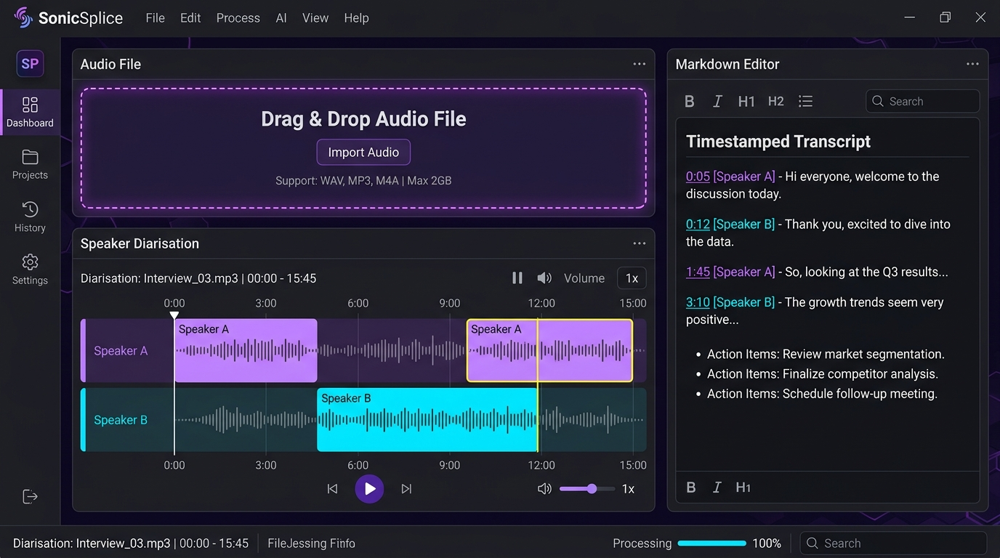

# Spltiz 🎙️

Spltiz is a local-first desktop application designed to process noisy voice memos on-device, generating high-fidelity, speaker-diarised, and timestamped transcripts alongside three actionable summary points.

## System Architecture

```
                       +---------------------------------------+
                       |                Spltiz                 |
                       |       (PySide6 Desktop Client)        |
                       +-------------------+-------------------+
                                           |
                                  Drag & Drop Audio
                                           v
                       +-------------------+-------------------+
                       |          audio_pipeline.py            |
                       +-------------------+-------------------+
                                           |
                        +------------------+------------------+
                        |                                     |
                        v                                     v
             +----------+----------+               +----------+----------+
             | Voice Activity Det. |               | Speaker Diarisation |
             |   (Librosa VAD)     |               | (MFCC Clustering)   |
             +----------+----------+               +----------+----------+
                        |                                     |
                        +------------------+------------------+
                                           |
                                           v
                       +-------------------+-------------------+
                       |       Local Gemma-2B Audio Engine     |
                       |      (OpenVINO CPU Acceleration)      |
                       +-------------------+-------------------+
                                           |
                                           v
                       +-------------------+-------------------+
                       |            summariser.py              |
                       |      (Task / Idea Classifier)         |
                       +-------------------+-------------------+
                                           |
                                           v
                       +-------------------+-------------------+
                       |          SQLite Local History         |
                       |              (spltiz.db)              |
                       +---------------------------------------+
```

## Preview



## One-Command Run

Build and launch the lightweight headless test suit inside Docker in a single step:

```bash
docker build -t spltiz .
```

To run the PySide6 app locally (requires X11 environment or native host):

```bash
pip install -r requirements.txt && python main.py
```

## Running Tests

Run the test suite directly with pytest:

```bash
pytest tests/
```
